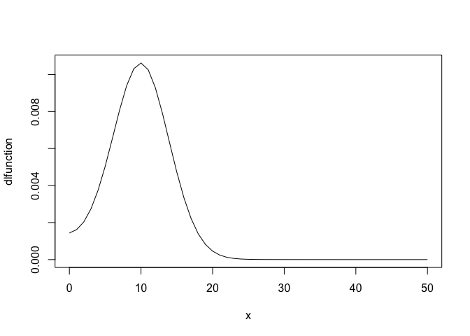
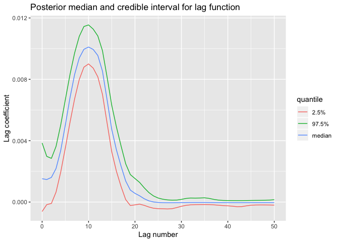

## Overview

`badlm` is a small R package for inferring the temporally delayed
dependence between a predictor and a response variable.

## Installation

To install the development version of the package, use

``` r
devtools::install_github("alastairrushworth/badlm")

# load the package
library(badlm)
```

## `badlm` example

Generate a distributed lag function

``` r
# a nice distributed lag function - hump
x          <- 0:50
dlfunction <- -0.1 + (0.01*exp(-0.2*x) + exp(dnorm(x, sd = 4, mean = 10))) / 10

plot(x, dlfunction, type = "l")
```

<!-- -->

Generate predictor and response under the distributed lag function

``` r
# response is an AR(1) process
expose        <- arima.sim(model = list(ar = 0.5), n = 500, sd = 0.1)
expose        <- (expose - mean(expose)) / sd(expose)
lag_mat       <- lag_matrix(expose, p = 50)
deaths.sig    <- lag_mat %*% dlfunction
deaths        <- deaths.sig + rnorm(450, sd = 0.01)
```

Try to recover the distribution lag function

``` r
dlm_est <- badlm(x = expose, y = deaths, 
           nlag = 50, k = 30, samples = 10000)
```

Plot the resulting lag curve

``` r
plot_lagcurve(dlm_est)
```

<!-- -->
